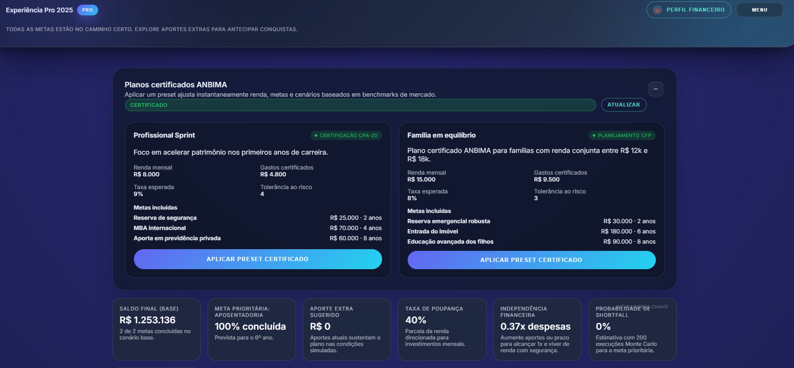
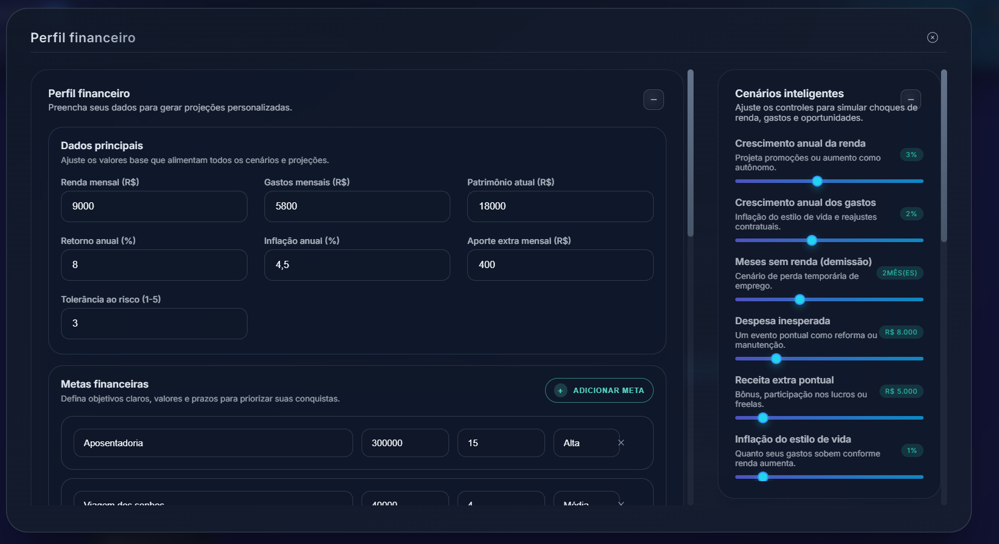

<h1 align="center">Financial Control • Planejamento financeiro inteligente</h1>

> 🌐 Leia em: **Português (PT-BR)** · [English](./README_EN.md)

> Simulador completo de evolução patrimonial com metas, cenários, recomendações (IA leve), presets certificados e recursos Pro colaborativos.

**Live demo:** https://financial-control-d0ix.onrender.com  
**Prints:**  
  


> Projeto em evolução contínua (estágio avançado). Código preparado para estudo, experimentação e futura hardening antes de um ambiente regulatório real.

---

## 🌐 Idiomas

- **Português (Brasil)** *(documentação principal)*
- English *(coming soon)*

## 🔍 Visão Geral do Produto

O usuário pode:
1. Cadastrar perfil financeiro (renda, gastos, patrimônio, impostos, metas, bônus, cenários).
2. Gerar simulações multi‐cenário (baseline, otimista, pessimista) + testes de estresse.
3. Receber recomendações inteligentes (quick wins, cortes, movimentos estratégicos, riscos, persona).
4. Adotar metas sugeridas automaticamente (priorizadas por categoria e horizonte).
5. Exportar dados (PDF / CSV / Excel / ICS) e preparar relatórios (WIP evolução PDF único consolidado).
6. Acessar Suite Pro: relatório comparativo ANBIMA, metas colaborativas e snapshot Open Finance (mock/síntese).
7. Colapsar/expandir todos os painéis com estado persistente por dispositivo.
8. Ajustar tema (dark/light) e trabalhar em modo foco sem distrações.

Arquitetura focada em modularidade: serviços de projeção, recomendação, metas recomendadas e presets certificados isolados.

## 🚀 Stack Técnica

| Camada | Tecnologias |
| ------ | ----------- |
| Frontend | React 18 + Vite, Context API, Hooks custom, Chart.js, html2canvas + jsPDF, SheetJS (XLSX) |
| Recomendação | TensorFlow.js (modelo leve + regras híbridas) |
| Exportações | PDF (canvas), CSV/Excel, ICS calendar, (futuro: pacote PDF consolidado) |
| Backend | Node.js 20+, Express 4, Mongoose 8, JWT, bcryptjs, Zod (validators) |
| Segurança | JWT, hashing de senha, validação, estrutura para rate limiting e CORS configurável |
| Build & DX | Concurrently, nodemon, dotenv, ESM, scripts de fallback de build frontend no servidor |
| Testes | Vitest (backend), placeholder para expansão de cenários e serviços |

Extras notáveis: persistência de estado de colapso por painel, lazy unmount para performance, animações suaves controladas por hooks.

## ✨ Principais Funcionalidades

- Simulação financeira multi-cenário com timeline e eventos (bônus, perda de renda, despesas inesperadas).
- Gestão de metas (prioridade, horizonte, acompanhamento de shortfall, projeção de atraso ou cumprimento antecipado).
- Metas recomendadas automaticamente (análise de perfil + heurísticas de baseline).
- Recomendações estruturadas: quick wins, cortes, movimentos estratégicos, riscos e persona sugerida.
- Relatório comparativo ANBIMA (baseline vs otimista vs pessimista) – versão inicial.
- Metas colaborativas (divisão de aportes por parceiro simulado).
- Snapshot Open Finance (mock sintético com volatilidade e cobertura de liquidez calculadas).
- Exportações: PDF (canvas), CSV/Excel (multi-aba), ICS (eventos de metas / marcos futuros).
- Histórico de simulações com comparação lado a lado (selecionar até duas) e comentários.
- Componentização colapsável universal (+/−) com persistência em localStorage e animação height.
- Tema dark/light, modo foco e UI responsiva otimizada para mobile (incluindo iPhone SE).
- Lazy render de painéis colapsados para ganho de performance.

Em progresso (iterativo): robustez de validações, melhoria de modelos de recomendação, export PDF consolidada e automação de testes.

## 🧩 Arquitetura & Fluxo de Simulação

1. Usuário insere perfil base + metas + impostos + bônus + composição de gastos.
2. Serviço de projeção calcula timeline mês a mês e avalia cumprimento de metas (on-time / atrasos / shortfall residual).
3. Camada de heurísticas gera recomendações e persona.
4. Modelo leve de recomendação complementa com sinais comportamentais (clusterização simplificada).
5. Resultados são exibidos em painéis colapsáveis + timeline + métricas e ficam disponíveis para exportação.

### Componentes Chave
| Componente | Papel |
| ---------- | ---- |
| `ProjectionChart` | Linha de evolução patrimonial com múltiplos cenários |
| `FinancialTimeline` | Eventos marcados: metas, choques, marcos projetados |
| `RecommendationPanel` | Quick wins, cortes, movimentos, riscos, persona |
| `ProInsightsPanel` | Relatório comparativo, colaborativo e Open Finance |
| `SimulationHistory` | Histórico interativo com comentários e seleção comparativa |
| `FinanceForm` (overlay) | Captura de perfil completo + metas + gastos + bônus |
| `CertifiedPresetsPanel` | Presets certificados (benchmarks) |
| `RecommendedGoalsPanel` | Metas sugeridas dinamicamente |
| `ScenarioControls` | Sliders de choques e ajustes de cenário |
| `StressTestList` | Impacto de choques sobre metas prioritárias |
| `ScenarioSummary` | KPIs dos cenários lado a lado |

## 🗂 Estrutura de Pastas (Resumo)

### UI & Identidade Visual

- Layout responsivo inspirado em Tailwind: gradientes radiais, glass cards e tipografia Inter.
- Landing/login híbrido (hero + formulário) com badges, métricas e storytelling.
- Widgets reordenáveis, badges temáticos e modo foco para apresentações.
- Tokens CSS centralizados em `global.css`, com suporte a tema claro/escuro e preferências de foco.

### Inteligência & Recomendações

- Modelo leve (três camadas densas) cria clusters comportamentais.
- Regras adicionam explicações transparentes (sinais de poupança, gastos e progresso de metas).
- Componentização permite trocar o modelo por APIs externas ou pipelines mais robustos.

### Segurança & Compartilhamento

- Links protegidos via AES-256 GCM + PBKDF2 (120k iterações) e salt/IV randomizados.
- Tokens de auth persistidos em localStorage com provider central.
- CORS, compressão e JWT prontos para endurecimento adicional.

```
client/
  src/
    components/     # Painéis e widgets principais
    context/        # Auth / Theme providers
    hooks/          # useFinancialSimulation e colapso de painéis
    ml/             # Modelo de recomendação (TensorFlow.js)
    services/       # API client
    utils/          # Export, format, criptografia
    styles/         # global.css (design system / tokens)
server/
  src/
    routes/         # auth, presets, pro, simulation
    models/         # User, Preset
    services/       # projection, recommendation, goals, proFeature
    middleware/     # auth, cache
    utils/          # validators, demoUser, cache helpers
  seed/             # init scripts
img/                # print_1.jpg, print_2.jpg
```

## 🛠️ Como Rodar Localmente

Pré-requisito: [Node.js 18 ou superior](https://nodejs.org/)

```bash
# instalar dependências do monorepo
npm install
npm install --prefix server
npm install --prefix client

# copiar variáveis de ambiente
cp .env.example .env            # ajuste conforme necessário
cp server/.env.example server/.env

# subir client + server juntos
npm run dev

# acessos padrão
# Frontend: http://localhost:5173 (ajusta para 5174 se a porta estiver em uso)
# API:      http://localhost:4000 (fallback automático para 4001)
```

### Build de Produção / Deploy

```bash
npm run build --prefix client
```

Os artefatos agora (padrão atualizado) são emitidos em `server/public` para facilitar deploy integrado (um único serviço Node servindo API + frontend).

Se você já tinha um fluxo antigo usando `client/dist`, ele ainda é suportado: o servidor procura em `CLIENT_DIST_PATH`, depois `server/public`, depois `client/dist`.

### Deploy (evitando "Cannot GET /")

1. Gere o build: `npm run build`
2. Inicie o servidor em modo produção: `npm run serve` (ou `npm run build:and:start` para ambos)
3. Garanta que a plataforma (Render, Railway, Fly, etc.) execute o comando `npm run build:and:start`
4. Se usar build separado (CI):
	- Passo de build: `npm run build`
	- Passo de start: `npm run serve`

Se ainda obtiver `Cannot GET /`:
 - Verifique logs: deve aparecer `[Static] Servindo client de: ...`
 - Confirme existência de `index.html` em um dos diretórios esperados.
 - Defina explicitamente `CLIENT_DIST_PATH` apontando para a pasta do bundle se o layout for personalizado.
 - Confirme que nenhuma regra de rewrite da plataforma está interceptando `/` antes do Node.

Resposta de fallback quando o build está ausente agora é: `API online. Build do frontend ausente. Rode: npm run build` — indicando claramente o problema.

## 🔧 Variáveis de Ambiente (Principais)

- `MONGODB_URI` – string de conexão (MongoDB Atlas/local). Sem ela, os recursos persistentes ficam indisponíveis.
- `JWT_SECRET` – chave para geração/validação de tokens.
- `VITE_API_BASE_URL` – URL base usada pelo front (default `''`, assume mesmo host).

Consulte `.env.example` e `server/.env.example` para mais detalhes.

## 📜 Scripts

| Contexto | Script | Descrição |
| -------- | ------ | --------- |
| monorepo | `npm run dev` | Orquestra cliente + servidor com concurrently. |
| client   | `npm run dev` | Vite com HMR. |
|          | `npm run build` | Build minificado do front. |
|          | `npm run preview` | Preview do bundle. |
| server   | `npm run dev` | Nodemon + Express. |
|          | `npm start` | Servidor em modo produção. |
|          | `npm run lint` | ESLint (Standard). |
|          | `npm test` | Vitest (placeholder preparado). |

## 📡 Endpoints Essenciais (Resumo)

| Método | Rota | Descrição |
| ------ | ---- | --------- |
| POST | `/api/auth/register` | Cria usuário (Basic ou Pro). |
| POST | `/api/auth/login` | Autentica e retorna JWT. |
| GET  | `/api/auth/me` | Perfil autenticado. |
| POST | `/api/simulations` | Roda a simulação financeira com payload completo. |
| GET  | `/api/presets` | Lista presets certificados. |
| POST | `/api/pro/reports/comparative` | Gera relatório comparativo (Pro). |
| POST | `/api/pro/goals/collaborative` | Calcula plano colaborativo (Pro). |
| GET  | `/api/pro/open-finance/snapshot` | Snapshot de contas (Pro). |

Payload típico de simulação (resumo):

```json
{
	"monthlyIncome": 9000,
	"monthlyExpenses": 5800,
	"currentSavings": 18000,
	"expectedReturnRate": 8,
	"inflationRate": 4.5,
	"additionalContribution": 400,
	"riskTolerance": 3,
	"expensesBreakdown": [{ "category": "Moradia", "amount": 2500 }],
	"goals": [{ "name": "Aposentadoria", "amount": 300000, "targetYears": 15 }],
	"scenario": { "incomeGrowthRate": 3, "jobLossMonths": 2 },
	"taxes": { "incomeTaxRate": 12, "investmentTaxRate": 15 },
	"annualBonuses": [{ "label": "13º", "month": 12, "amount": 9000 }]
}
```

## 🛣️ Roadmap (Resumo)

- [ ] Deploy público (Render/Vercel + Atlas) com CI/CD.
- [ ] Autenticação multifator e recuperação segura.
- [ ] Persistência de histórico e presets customizados por usuário.
- [ ] Testes ponta a ponta (Playwright) cobrindo landing ➜ login ➜ simulação.
- [ ] Monitoramento (Pino, OpenTelemetry) e observabilidade pró-ativa.
- [ ] Automação de relatórios PDF + assinatura digital.

## ♿ Acessibilidade & UX

- Navegação por teclado com foco visível e atalhos para modo foco.
- Semântica ARIA aplicada em widgets interativos e timeline.
- Landing responsiva com contraste testado e microinterações discretas.
- Backlog inclui auditorias contínuas (axe-core/NVDA) e preferências de redução de movimento.

## ⚠️ Aviso

Projeto educacional/portfolio. Não armazene dados sensíveis em produção sem reforçar autenticação, rate limiting, observabilidade, backups e governança de acesso.

## 📄 Licença

Distribuído sob licença **MIT**. Consulte `LICENSE` para detalhes.

## 🙌 Créditos

<p align="center"><sub>Financial Control — metas, cenários e decisões financeiras mais claras.</sub></p>

Criado por **Caio Marques (Hiidoko)**  
[LinkedIn](https://linkedin.com/in/hiidoko)

Se este simulador te ajudou, deixe uma ⭐️ e compartilhe feedbacks! Melhorias e contribuições são bem-vindas.
