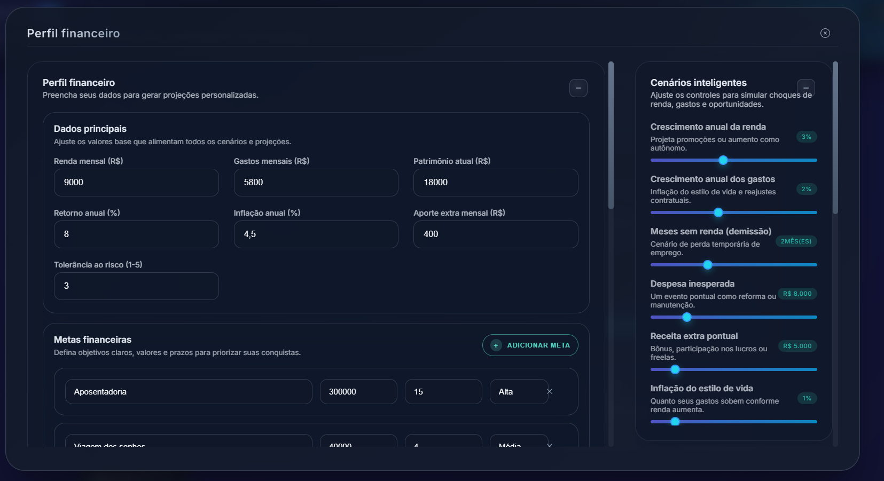

<h1 align="center">Financial Control • Intelligent Personal Finance Simulation</h1>

> 🌐 Read in: **English** · [Português (PT-BR)](./README.md)

> Full‑stack simulator for long‑term wealth projection: multi‑scenario timeline, goal tracking, intelligent recommendations (hybrid ML + rules), certified presets, collaborative planning (Pro) and export suite.

**Live demo:** https://financial-control-d0ix.onrender.com  
**Screenshots:**  
  


> Status: advanced iterative development. Suitable for study / experimentation. Additional hardening required for regulated production contexts (security, audit, resilience).

---

## 🔍 Product Overview
Users can:
1. Enter full financial profile (income, expenses, savings, taxes, bonuses, goals & scenario shocks).
2. Generate multi‑scenario simulations (baseline / optimistic / pessimistic) + stress tests.
3. Receive structured recommendations (quick wins, cuts, strategic moves, risk mitigation, persona).
4. Adopt automatically suggested goals (ranked by priority & horizon).
5. Export data (PDF / CSV / Excel / ICS) – consolidated PDF roadmap WIP.
6. Access Pro Suite: ANBIMA comparative report, collaborative goal planning, Open Finance snapshot (synthetic demo data).
7. Collapse/expand all panels with persistent state (localStorage) and smooth animation.
8. Switch dark/light theme and use focus mode for distraction‑free review.

---
## 🚀 Tech Stack
| Layer | Technologies |
| ----- | ----------- |
| Frontend | React 18 + Vite, Context API, custom hooks, Chart.js, html2canvas + jsPDF, SheetJS (XLSX) |
| Recommendation | TensorFlow.js lightweight model + rule enrichment |
| Exports | PDF (canvas), CSV / Excel, ICS (calendar events) |
| Backend | Node.js 20+, Express 4, Mongoose 8, JWT, bcryptjs, Zod validators |
| Security Baseline | JWT auth, password hashing, validation, CORS structure (rate limiting placeholder) |
| Build & DX | Concurrently, nodemon, dotenv, ESM, automatic frontend build fallback on server start |
| Tests | Vitest (backend core – expansion planned) |

Performance niceties: lazy unmount of collapsed panels, height transitions, persisted UI preferences.

---
## ✨ Key Features
- Multi‑scenario wealth projection (timeline with events: bonuses, job loss months, unexpected expenses).
- Goal management (priority, horizon, progress, shortfall + delayed projection view).
- Auto recommended goals (profile heuristics).
- Recommendation engine panels: quick wins, expense cuts, strategic moves, risk scenarios, behavioral persona.
- ANBIMA comparative report (baseline vs optimistic vs pessimistic) – initial iteration.
- Collaborative planning (suggested partner contributions to shared goals – mock pipeline structure).
- Open Finance snapshot (synthetic accounts: volatility & liquidity coverage metrics).
- Exports: PDF (visual snapshot), CSV/Excel multi-sheet (timeline, goals, scenarios), ICS (goal milestone events).
- Simulation history with dual comparison & note taking.
- Universal collapsible panels (+/−) with persistent state & animated height transitions.
- Responsive UI tuned for small devices (including iPhone SE width) and accessible focus flows.
- Dark/Light theme toggle & focus mode.

In progress: richer validation, upgraded recommendation model, consolidated multi‑section PDF export, expanded test coverage.

---
## 🧩 Simulation Flow
1. User provides profile + goals + taxes + bonuses + expense breakdown.
2. Projection service builds monthly timeline & evaluates goal achievement (on‑time / delayed / shortfall).
3. Heuristic & ML hybrid layer produces recommendations and persona classification.
4. KPIs & comparative metrics feed charts, summaries, stress test impact and snapshot panels.
5. Exports package transforms normalized data into chosen formats.

### Core Components
| Component | Purpose |
| --------- | ------- |
| `ProjectionChart` | Wealth evolution line chart across scenarios |
| `FinancialTimeline` | Annotated events (goals, shocks, projections) |
| `RecommendationPanel` | Structured advisory sections |
| `ProInsightsPanel` | Comparative, collaborative and Open Finance snapshot |
| `SimulationHistory` | Historical runs + selection & comments |
| `FinanceForm` (overlay) | Full financial + scenario data entry |
| `CertifiedPresetsPanel` | Benchmarked certified presets |
| `RecommendedGoalsPanel` | Auto generated prioritized goals |
| `ScenarioControls` | Scenario shocks / sliders |
| `StressTestList` | Impact of shocks on key goal viability |
| `ScenarioSummary` | Scenario KPI cards |

---
## 🗂 Folder Structure (Summary)
```
client/
  src/
    components/     # Panels & widgets
    context/        # Auth & Theme providers
    hooks/          # useFinancialSimulation, collapse state hooks
    ml/             # TensorFlow recommendation model
    services/       # API client layer
    utils/          # Exporters, formatters, crypto helpers
    styles/         # global.css design tokens & themes
server/
  src/
    routes/         # auth, presets, pro, simulation
    models/         # User, Preset
    services/       # projection, recommendation, goals, pro features
    middleware/     # auth, cache
    utils/          # validators, demo user, cache
  seed/             # init scripts
img/                # print_1.jpg, print_2.jpg
```

---
## 🛠️ Local Setup
Prerequisite: [Node.js 18+](https://nodejs.org/)
```bash
# Install root, server and client deps
npm install
npm install --prefix server
npm install --prefix client

# Environment examples
cp .env.example .env
cp server/.env.example server/.env

# Dev (concurrent)
npm run dev
```
Frontend: http://localhost:5173  
API: http://localhost:4000

### Production Build / Integrated Serve
```bash
npm run build --prefix client
npm run build   # optional server-side steps if defined
npm run serve   # serve API + static client
```
The server searches `server/public`, then `client/dist` (or `CLIENT_DIST_PATH` override) to serve the SPA and prevent `Cannot GET /` issues.

---
## 🔧 Environment Variables
| Name | Purpose |
| ---- | ------- |
| `MONGODB_URI` | Mongo connection string |
| `JWT_SECRET` | JWT signing secret |
| `VITE_API_BASE_URL` | Override frontend API base (same-origin fallback) |
| `CLIENT_DIST_PATH` | Explicit path to built frontend (optional) |

---
## 📜 Scripts
| Context | Script | Description |
| ------- | ------ | ----------- |
| root | `npm run dev` | Concurrent server + client |
| client | `npm run dev` | Vite HMR |
|       | `npm run build` | Production client build |
| server | `npm run dev` | Nodemon dev server |
|       | `npm start` | Production mode |
|       | `npm test` | Vitest (backend) |
|       | `npm run lint` | ESLint Standard |

---
## 📡 Core Endpoints (Sample)
| Method | Route | Description |
| ------ | ----- | ----------- |
| POST | `/api/auth/register` | Create user (Basic / Pro) |
| POST | `/api/auth/login` | Authenticate (JWT) |
| GET  | `/api/auth/me` | Current profile |
| POST | `/api/simulations` | Run simulation |
| GET  | `/api/presets` | List certified presets |
| POST | `/api/pro/reports/comparative` | Generate comparative report |
| POST | `/api/pro/goals/collaborative` | Collaborative goal split |
| GET  | `/api/pro/open-finance/snapshot` | Synthetic Open Finance snapshot |

---

---
## ♿ Accessibility & UX
- Keyboard navigable panels, visible focus ring.
- Collapsible buttons with `aria-expanded`, `aria-controls`, lazy unmount.
- Reduced motion consideration (hook ready for extension).
- Mobile‑first refinements for narrow viewports (< 400px) without horizontal scroll.

---
## ⚠️ Disclaimer
Educational / portfolio project. Not audited for production security or compliance. Do not store sensitive personal data without further hardening.

---
## 📄 License
MIT License. See `LICENSE` for details.

---
## 🙌 Credits
Created by **Caio Marques (Hiidoko)**  
[LinkedIn](https://linkedin.com/in/hiidoko)

If this project helps you, consider leaving a ⭐ and sharing feedback.

<p align="center"><sub>Financial Control — clearer goals, scenarios & decisions.</sub></p>
